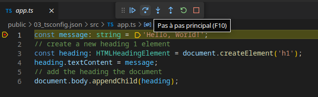
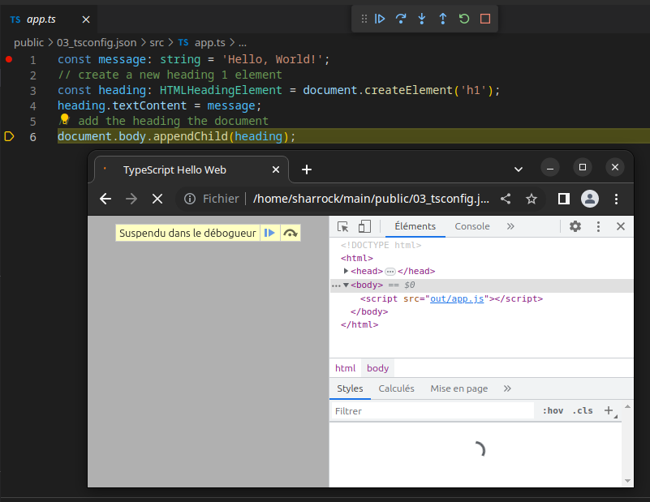
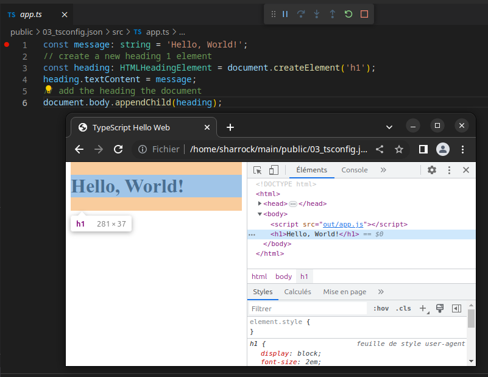

# 04_Debug

:memo: [éditer cette page](https://gitlab.com/-/ide/project/webdev101/04_debug/edit/main/-/README.md)

## cloner le dépôt

dans VSCode, clonez le dépôt <https://gitlab.com/webdev101/04_debug.git>

## transpiler

vous devez d'abord transpiler avec `tsc` ou `tsc -w`

## debug pas à pas

mettre un [breakpoint](https://code.visualstudio.com/docs/editor/debugging#_breakpoints) à la première ligne de app.ts et tester le debug pas à pas



## vérification de la modification du DOM

vérifiez que le [DOM](https://developer.mozilla.org/fr/docs/Web/API/Document_Object_Model) est modifié lors de l'exécution de la ligne

```typescript
document.body.appendChild(heading);
```

pour cela, lors du debug pas à pas, [ouvrez les outils pour les développeurs dans Chrome](https://developer.chrome.com/docs/devtools/open/) et inspectez le DOM dans l'onglet éléments.

remarquez que l'élément `h1` n'existe pas avant l'exécution de la dernière ligne du script



et qu'après l'exécution de la dernière ligne il est ajouté dans l'élément `body`



# exercice 

créez le fichier `.tsconfig` pour configurer le transpileur et ajoutez une ligne 
à la fin de `app.ts` pour changer la couleur du texte de l'élément `h1` en rouge:
    
```typescript
heading_04.style.color = "red";
```
Faites une photo d'écran de votre navigateur avec les devtools ouverts pour prouver que le DOM est modifié et ajoutez cette photo dans votre dépôt pour prouver que vous avez réussi l'exercice.
